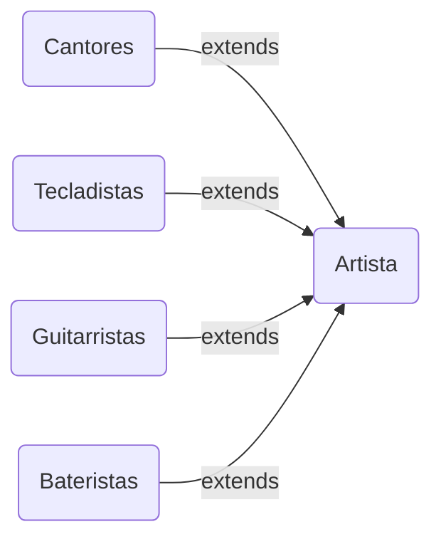

# POO - Classes Artista, Cantores, Tecladistas, Guitarristas e Bateristas

Projeto acadêmico em **Java** da matéria de Programação Orientada a Objetos. Programa desenvolvido com o objetivo de aprender os conceitos de **POO** utilizando as classes Artista, Cantores, Tecladistas, Guitarristas e Bateristas, criando atributos, métodos e construtores para cada classe. As classes Cantores, Tecladistas, Guitarristas e Bateristas herdam da classe Artista.

